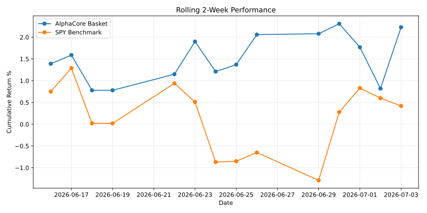

# FinMan AlphaCore Daily Picks – 2026-06-23

## Today's Picks

| Sector | Pick | Bias | Confidence | Historical Accuracy | Similar Setups | Avg Similarity | Reliability | Expected 14-Day Return | Predicted 14-Day Price | Top Signal |
|---|---|---|---:|---:|---:|---:|---|---:|---:|---|
| Technology | TEL | Bearish | 29.3% | 76.0% | 25 | 96.0% | Medium | -4.77% | $201.028625 | market_breadth |
| Healthcare | ABBV | Bearish | 55.9% | 80.0% | 25 | 98.0% | Medium | -6.73% | $198.596967 | market_breadth |
| Financials | L | Bullish | 56.2% | 92.0% | 25 | 91.5% | Medium | 7.13% | $111.234041 | market_breadth |
| Energy | ENB | Bullish | 54.3% | 72.0% | 25 | 91.7% | Medium | 19.42% | $65.599189 | market_breadth |
| Consumer | MCD | Neutral | 50.2% | 72.0% | 25 | 95.8% | Medium | 1.70% | $278.905993 | market_breadth |
| Industrials | GD | Bearish | 38.4% | 100.0% | 25 | 95.2% | Medium | -2.79% | $329.721902 | market_breadth |

## Rolling 2-Week Performance

| Period | AlphaCore Basket | SPY | Excess Return |
|---|---:|---:|---:|
| Last 2 Weeks | +1.90% | +0.51% | +1.39% |

## Historical Performance

| Date | AlphaCore Basket | SPY | Excess Return |
|---|---:|---:|---:|
| 2026-06-23 | +1.90% | +0.51% | +1.39% |
| 2026-06-22 | +1.15% | +0.94% | +0.21% |
| 2026-06-19 | +0.78% | +0.02% | +0.76% |
| 2026-06-18 | +0.78% | +0.02% | +0.76% |
| 2026-06-17 | +1.59% | +1.29% | +0.30% |
| 2026-06-16 | +1.39% | +0.75% | +0.64% |
| 2026-06-15 | +1.49% | +0.75% | +0.74% |
| 2026-06-12 | +0.93% | +0.40% | +0.53% |
| 2026-06-11 | +0.28% | -0.15% | +0.42% |
| 2026-06-10 | +0.00% | +0.00% | +0.00% |

## Skipped Tickers

| Sector | Ticker | Reason |
|---|---|---|
| Financials | MMC | inactive_or_no_recent_data |
| Financials | DFS | inactive_or_no_recent_data |
| Energy | HES | inactive_or_no_recent_data |
| Energy | CTRA | inactive_or_no_recent_data |
| Energy | MRO | inactive_or_no_recent_data |
| Energy | CIVI | inactive_or_no_recent_data |

## History

This page is part of the daily AlphaCore public tracking archive.

**Disclaimer – Technology Experiment / Not Financial Advice**

FinMan AlphaCore is an experimental artificial intelligence and market research project created for educational, research, and technology demonstration purposes.

The information presented is generated from automated model analysis and historical market data. It is not financial advice, investment advice, trading advice, legal advice, tax advice, or a recommendation to buy, sell, or hold any security.

Model predictions may be inaccurate. Past performance does not guarantee future results. Investing involves risk, including possible loss of principal.

